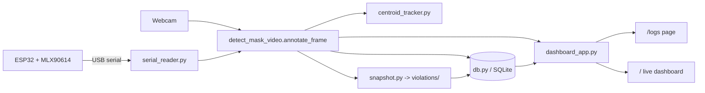

# Face Mask & Temperature Screening System

An automated entry-screening system that combines **face mask detection** with
**contactless body temperature measurement**. A webcam feed is analyzed in real
time to detect whether each person is wearing a mask, an ESP32 + MLX90614 IR
sensor reports the person's temperature, and the two signals are fused into a
single green / yellow / red screening decision. Every screening is logged to a
local database, and any "No Mask" or "Fever" event is captured as a cropped
snapshot for later review.

## Context & Motivation

Manual entry screening (temperature guns + visual mask checks) is slow, requires
staff, and keeps no reliable audit trail. This project automates that workflow:

- **Vision side:** OpenCV face detection + a MobileNetV2 classifier decides
  `Mask` vs `No Mask` per detected face.
- **Sensor side:** an ESP32 reads an MLX90614 infrared thermometer and streams
  the object (forehead) temperature to the PC over USB serial.
- **Fusion:** a person passes only when they are masked **and** below the fever
  threshold. No mask **or** high temperature raises a red flag.
- **Auditability:** each event is written to SQLite with a timestamp, and every
  violation is saved as an image crop, so results are reviewable after the fact.

## Features

- Real-time multi-face detection with a ResNet-10 SSD face detector, plus a Haar
  cascade fallback for difficult frames.
- MobileNetV2 mask classifier (`mask_detector.h5`).
- Centroid tracker that assigns a stable ID to each person across frames.
- ESP32 + MLX90614 temperature reading over serial, mapped to the primary person
  (the face closest to the sensor ROI).
- Combined green / yellow / red risk signal.
- **SQLite entry logging** with per-person debounce (a person standing in frame
  is logged at most once every ~8 seconds using their tracker ID).
- **Automatic violation snapshots** — cropped images of only the flagged person,
  saved to `violations/` with the timestamp, reason, and person ID in the
  filename.
- **Web dashboard** (Flask + Socket.IO) with a live feed, per-person telemetry,
  a screening logs page with stats and a snapshot gallery.

## Architecture



`annotate_frame()` in [detect_mask_video.py](detect_mask_video.py) is the shared
core used by **both** the standalone OpenCV window and the Flask dashboard, so
logging and snapshots work identically in either mode.

## Screening Logic

For the primary person (closest to the sensor ROI):

- **Green** — mask detected and temperature below the fever threshold.
- **Yellow / waiting** — mask detected but temperature not yet available.
- **Red** — no mask, or temperature at/above the fever threshold.

The fever threshold defaults to `37.5 C` and can be changed in `config.json`.
The `temp_status` field (`Normal` / `Fever`) together with the
mask status forms a **combined risk flag**: a violation is any `No Mask` **or**
`Fever` result.

### Debounce

To avoid flooding the database while one person stands in frame,
`should_log(person_id, cooldown_seconds=8)` in [db.py](db.py) allows at most one
write per tracker ID per cooldown window. It uses an in-memory cache as the hot
path (checked every frame) and falls back to the person's most recent logged
timestamp in the database on the first sighting of an ID in a fresh process, so
the cooldown also survives restarts.

## Data Model

Entries are stored in `screening_log.db` (table `entries`):

| Column | Type | Notes |
| --- | --- | --- |
| `id` | INTEGER | Primary key |
| `timestamp` | TEXT | ISO timestamp (seconds precision) |
| `person_id` | INTEGER | Centroid tracker ID |
| `mask_status` | TEXT | `Mask` / `No Mask` |
| `temperature` | REAL | Forehead temp in C (primary person only) |
| `temp_status` | TEXT | `Normal` / `Fever` / `NULL` |
| `snapshot_path` | TEXT | Relative path to violation crop, or `NULL` |

Violation snapshots are named
`YYYYMMDD_HHMMSS_ffffff_<reason>_p<personID>.jpg`, where `reason` is `nomask`,
`fever`, or `nomask_fever` — so the images are audit-ready from the filename
alone, without any extra metadata file.

## Project Structure

```
Face-Mask-Detection/
├── detect_mask_video.py   # OpenCV window + shared annotate_frame() core
├── dashboard_app.py       # Flask + Socket.IO web dashboard
├── centroid_tracker.py    # Per-person ID tracking
├── serial_reader.py       # ESP32 MLX90614 serial reader (threaded)
├── config_manager.py      # config.json load/save
├── db.py                  # SQLite logging + debounce helper
├── snapshot.py            # Violation snapshot cropping/saving
├── mask_detector.h5       # Trained MobileNetV2 mask classifier
├── face_detector/         # SSD face detector prototxt + weights
├── templates/             # dashboard.html, logs.html
├── esp32_mlx90614_temperature/  # Arduino sketch for the ESP32
├── requirements.txt
├── TEMPERATURE_SETUP.md   # Wiring + Arduino setup guide
└── README.md
```

## Setup

1. Create/activate a virtual environment and install dependencies:

```powershell
python -m venv .venv
.\.venv\Scripts\Activate.ps1
pip install -r requirements.txt
```

2. (Optional, for temperature) Flash the ESP32 with
   `esp32_mlx90614_temperature/esp32_mlx90614_temperature.ino` and wire the
   MLX90614 as described in [TEMPERATURE_SETUP.md](TEMPERATURE_SETUP.md).

## Running

### Web dashboard (recommended)

```powershell
.\.venv\Scripts\python.exe dashboard_app.py
```

Then open:

- `http://127.0.0.1:5000` — live dashboard
- `http://127.0.0.1:5000/logs` — screening logs, stats, and violation gallery

### Standalone OpenCV window

```powershell
.\.venv\Scripts\python.exe detect_mask_video.py
.\.venv\Scripts\python.exe detect_mask_video.py --temp-port COM4
```

Press `q` in the video window to quit. Both modes create `screening_log.db` and
the `violations/` folder on first run.

## Configuration

Runtime settings live in `config.json` (git-ignored):

- `fever_threshold_c` — fever cutoff in Celsius (default `37.5`)
- `temp_port` / `temp_baud` — ESP32 serial port and baud rate

## Notes

- `config.json`, `screening_log.db`, and `violations/` are git-ignored: they hold
  local secrets/state and generated data.
- If no ESP32 is connected, mask detection still runs; temperature-dependent
  results simply stay in the yellow/waiting state.
